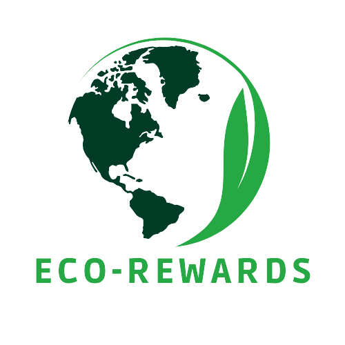

# Eco-Rewards



[Website deployed with Azure](https://gentle-plant-0fba2ab1e.3.azurestaticapps.net/)

Built with **React.js**

## About the EcoRewards

The website introduces EcoRewards app that combines sustainability and rewards. Users can easily track their activities and calculate their carbon footprint, gaining valuable insights into their environmental impact. By earning points for eco-friendly choices, individuals are encouraged to make sustainable decisions in their daily lives. The website also provides the opportunity to redeem earned points at a network of conscious businesses, where users can enjoy exclusive rewards and discounts. 

## About the project

EcoRewards is an innovative solution that was developed for the TechTogether 2023 hackathon. Our team of passionate developers, designers, and sustainability enthusiasts came together to create a platform that promotes sustainable actions while providing incentives and rewards. Recognizing the importance of addressing climate change and encouraging conscious choices, we developed EcoRewards as a user-friendly app that tracks activities, calculates carbon footprints, and offers a gamified experience. Our project was inspired by the hackathon's mission to leverage technology for positive environmental impact, and we are excited to share EcoRewards with the world as a tool to empower individuals and communities to make a tangible difference in the fight against climate change.

## Installation

1. Clone repository
2. Install Node.js

## Usage

3. Run the following commands 
```bash
npm i
npm start
```

## Figma 
[User Interface link 1](https://tinyurl.com/eco-rewards-figma-1)

[User Interface link 2](https://tinyurl.com/eco-rewards-figma-2)

## Team members
 [Cecilia](https://www.linkedin.com/in/cgarcialopez/)

 [Alexis](https://www.linkedin.com/in/yytong39/)

 [Rachel](https://www.linkedin.com/in/rachel-fingerhut)

 [Meredith](https://www.linkedin.com/in/yu-meredith-luo/)
